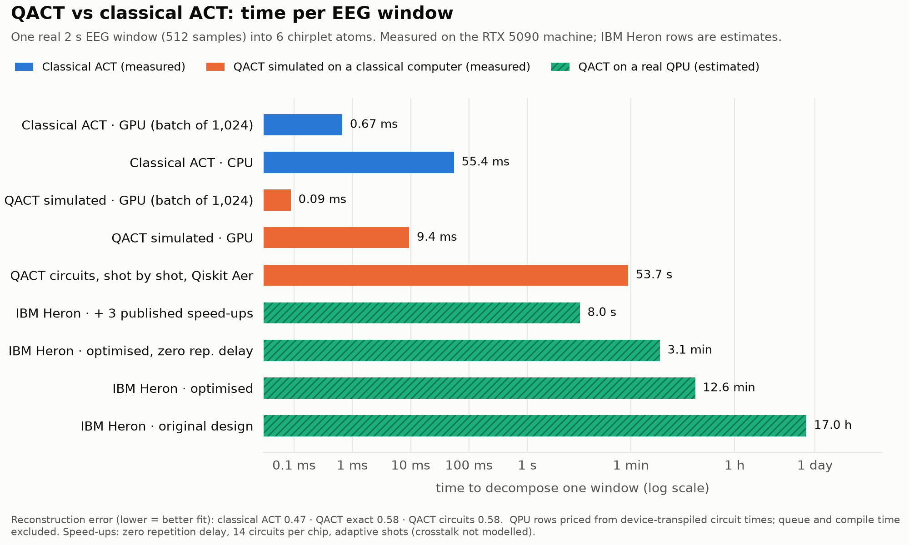

# Quantum Brain Encoding

Full citations for every method, dataset and baseline: [REFERENCES.md](REFERENCES.md).

Muse EEG → **Adaptive Chirplet Transform** → **Qiskit** quantum classifier.

Raw four-channel Muse EEG is decomposed into Gaussian chirplet atoms, those
atoms are aggregated into physically interpretable features, and the features
are classified with a quantum kernel SVM (QSVC) — benchmarked against a
variational classifier and two classical baselines on identical folds.

---

## What this project found

Every comparison below is pre-registered, uses subject-wise or patient-wise folds,
and reports paired non-parametric tests with Bonferroni correction. Negative
results are kept in place rather than deleted, including three findings that were
later corrected or refuted by their own controls.

1. **Chirplet features are worth +9 to +13 accuracy points beyond amplitude
   features** for cross-patient seizure detection. Replicated on two independent
   databases: CHB-MIT +10.4 points, Siena +9.43 (*p* = 0.0047) and +13.31
   (*p* = 0.0040). This is the project's one solid, reproduced positive result.
   Best absolute accuracy 79.2% (Siena), 76.8% (CHB-MIT).
2. **Every quantum *classifier* landed at parity or below**, each with a control
   explaining why: QSVC, VQC, projected quantum kernels, data re-uploading, a
   hybrid model, QLSTM (+0.014 vs +0.106 for a plain LSTM), and quantum reservoirs
   (entanglement contributes +0.024 over its own J=0 control on 23/23 people — a
   real effect, but an ESN still wins outright).
3. **A quantum ACT (QACT) brought to full functional parity with the classical
   engine is its exact peer on real EEG denoising — no better, no worse.** It
   appeared to *win* (1.272 vs 1.439, 17 of 18 held-out subjects) until the
   control arm reported: the entire difference was QACT's finer frequency grid,
   which the QFT supplies for free. Give the classical engine the same 0.5 Hz
   seeds and the gap vanishes (*p* = 0.15 to 1.00, and the QACT arm restricted to
   the classical function set is significantly *worse*). Real structural
   property, real constant-factor resource saving, not an advantage — see
   [the denoising section](#denoising-the-one-task-with-real-ground-truth). The
   parity work was still worth doing: it found a genuine selection bug and moved
   QACT from 70% worse than classical to statistically indistinguishable.
4. **On real quantum hardware, QACT's circuits were cut to what current devices
   can run — for short atoms.** Folding the envelope into state preparation, a
   semiclassical QFT and window-local registers take a short atom's circuit from
   2,027 to 142 CZ gates; under IBM Heron's noise model it then selects the right
   atom, where the original design never did. Branch-and-bound and 3-point
   refinement cut circuit executions per atom ~80x. Long atoms still do not fit:
   state preparation is ~87% of what remains. See
   [Making QACT cheaper on real quantum hardware](#making-qact-cheaper-on-real-quantum-hardware).
5. **Recurring lesson, confirmed three times: reconstruction quality and
   classification value are nearly unrelated.** Atom-level improvements that are
   real and measurable (better fits, new atom families, smarter selection)
   repeatedly produced no gain in downstream accuracy.

---

## Why chirplets

A chirplet atom is a Gaussian-windowed linear-FM waveform with four continuous
parameters: centre time `tc`, centre frequency `fc`, log-duration `logDt`, and
**chirp rate `c`**. A Gabor or wavelet atom is the special case `c = 0`.

That fourth parameter is the entire point. Real EEG transients drift in
frequency, and a stationary atom can only represent a drifting burst by
smearing it across several frequency bins. **Chirp rate is information a Welch
spectrum structurally cannot report.**

Decomposition is by orthogonal matching pursuit: pick the dictionary atom best
correlated with the residual, refine its parameters off-grid with an
analytic-gradient L-BFGS-B step plus a Newton polish, re-fit all coefficients,
repeat.

Implementation: [adaptive-chirplet-transform](https://gitlab.com/adaptive-chirplet-transform/adaptive-chirplet-transform)
(Mann & Haykin's chirplet transform; ACT engine by A. Vicol et al.).

## Why a quantum kernel

`QSVC` implements Havlíček et al., *Supervised learning with quantum-enhanced
feature spaces* (Nature **567**, 2019). Each feature vector **x** is encoded
into a circuit U(**x**) — a `ZZFeatureMap`, whose entangling layer applies
rotations proportional to feature *products*. The kernel is the state overlap

```
K(x, x') = |⟨0| U†(x') U(x) |0⟩|²
```

and that Gram matrix goes to an ordinary SVM. **Nothing quantum is trained** —
the kernel is deterministic and the remaining optimisation is the SVM's convex
dual, so there are no barren plateaus and no optimiser tuning. `VQC` is the
variational alternative, included for comparison and genuinely harder to train.

---

## Install

Qiskit has no Python 3.14 wheels yet, so use 3.12:

```bash
uv venv --python python3.12 .venv
VIRTUAL_ENV=.venv uv pip install -r requirements.txt
```

## Run

No headband required — a realistic synthetic Muse generator is the default:

```bash
.venv/bin/python run_qbe.py --source synthetic --jobs 8
```

Inspect the chirplet decomposition of a single epoch, in physical units:

```bash
.venv/bin/python run_qbe.py --source synthetic --explain
```

Your own Mind Monitor CSV exports, one folder per class:

```bash
.venv/bin/python run_qbe.py --source csv --data data --jobs 8
```
```
data/eyes_open/*.csv
data/eyes_closed/*.csv
```

Live capture (run `muselsl stream` in another terminal first):

```bash
.venv/bin/python run_qbe.py --source lsl --seconds 60 --blocks 4
```

---

## What the pipeline does, and three things that are easy to get wrong

### 1. The headband does *not* clean the raw channels

The Muse streams two different kinds of data:

| stream | cleaned on-device? |
|---|---|
| Band powers (`Delta_TP9`, `Alpha_AF7`, …), fit indicator | **Yes** — Muse's own filtering, FFT and artifact blanking |
| Raw channels (`TP9_RAW`…`TP10_RAW`) | **No** — essentially ADC output |

What *is* applied to the raw channels is analog, not algorithmic: an anti-alias
band-limit ahead of the 12-bit ADC, and the DRL/reference circuit doing
common-mode rejection (which kills much of the mains hum as a side effect).
There is no digital notch, no artifact rejection and no packet-loss repair.

This pipeline uses the **raw** channels, because ACT needs a time-domain
waveform. Muse's on-device band powers cannot be chirplet-decomposed, and using
them would discard the entire reason to choose ACT.

### 2. Filtering is off by default — because it measurably hurt

Not a stylistic choice. On synthetic eyes-open/closed epochs, alpha-fraction
separability was:

| preprocessing | Cohen's *d* |
|---|---|
| **none (default)** | **+1.16** |
| 1 Hz zero-phase high-pass | +0.50 |
| 2 Hz zero-phase high-pass | +0.84 |

The high-pass yields *more* oscillatory atoms but *worse* discrimination,
because it also lifts alpha-band content in the eyes-open condition
(alpha fraction 0.000 → 0.039), creating a false-positive floor. Separately,
the chirplet dictionary already *is* the band-pass — its `fc` grid spans
0.5–40 Hz, so out-of-band noise lands in the residual — and an IIR band-pass
smears exactly the transient onsets ACT exists to resolve.

`--bandpass` and `--notch` remain available. Turn them on deliberately, and
re-measure.

What *is* applied is the upstream **gate**, which the headband cannot do for
you: reject windows with non-finite samples, dropped Bluetooth packets
(512 samples must span 1.5–2.2 s), ADC-rail saturation, flat channels, and
blink/clench artifacts. Surviving epochs are zero-meaned and unit-L2
normalised, so every feature is a *fraction* of epoch energy.

### 3. PCA destroys the signal — use supervised selection

The reduction from 52 chirplet features to `--qubits` is where naive pipelines
lose their accuracy. PCA maximises **variance**, not class separation:

| | best Cohen's *d* |
|---|---|
| Best single chirplet feature (`TP10_frac_alpha`) | **0.80** |
| Best PCA(4) component | 0.47 |

`--reduce selectk` (default) uses an ANOVA F-test and selects TP9/TP10 alpha
fraction and oscillatory fraction — posterior alpha, the physiologically
correct answer. `--reduce pca` is kept for comparison.

Measured on the same 178 synthetic epochs, 5-fold CV:

| reducer | qubits | qsvc | svm_rbf | logreg |
|---|---|---|---|---|
| pca | 4 | 58.5% | 55.5% | 56.0% |
| pca | 6 | 60.2% | 67.9% | 67.9% |
| **selectk** | **4** | **66.8%** | **67.9%** | **69.0%** |
| selectk | 6 | 65.2% | 66.8% | 68.5% |

PCA does not destroy the discriminative direction so much as *take longer to
reach it* — its best component scores d = 0.47 at 4 components and d = 0.71 at
6. That is why it costs 8–13 points at 4 components and mostly recovers at 6.

Which matters because **qubits are the scarce resource** — one per feature.
Supervised selection buys the same accuracy for two fewer qubits.

The reducer is fitted **inside** the cross-validation pipeline, so it never
sees the held-out fold.

---

## Features

Per channel (13), concatenated over TP9/AF7/AF8/TP10 → **52 features**:

| feature | meaning |
|---|---|
| `frac_delta … frac_gamma` | atom energy fraction per classical band |
| `osc_frac` / `transient_frac` | rhythm vs drift/transient energy split |
| `mean_fc_hz`, `std_fc_hz` | energy-weighted spectral centroid and spread |
| `mean_abs_sweep_hz`, `mean_signed_sweep_hz` | **chirp** — Hz traversed per atom |
| `mean_dur_s` | energy-weighted atom duration |
| `recon_err` | how well chirplets explain the epoch |

All are energy-weighted aggregates, so they are invariant to the greedy
ordering of the atom list.

### Oscillatory vs transient atoms

On realistic 1/f EEG **most atoms come back non-oscillatory** — `fc → 0`,
short, slow Gaussian bumps. That is not a bug: pink noise genuinely carries
most of its energy at low frequency, so greedy OMP correctly spends its first
atoms there.

So the atoms are split rather than fought. An atom counts as a *rhythm* only if
it has ≥ 0.5 cycles in its own envelope, a centre frequency in 0.5–40 Hz, a
duration no longer than the epoch, and a sweep ≤ its own centre frequency.
Everything else is pooled into one `transient_frac` feature — drift and
residual blink energy are informative, not merely noise.

The last two tests matter: the bounded off-grid refinement can overshoot and
return atoms wider than the epoch (observed: a 17.9 s atom on a 2.0 s epoch,
sweeping 9155 Hz). The thresholds were tuned by measured class separation, not
by taste — `MIN_CYCLES = 0.5` scored *d* = 0.91, while raising it to 2.0 cost
0.15 *d*.

---

---

## Real data: PhysioNet EEGMAT

The synthetic generator is for plumbing. The real evaluation uses **EEGMAT**
(Zyma et al., *Data* 4(1), 2019): 36 subjects, rest (~180 s) vs mental
arithmetic (~60 s), 19-channel 10-20 montage at 500 Hz, ICA-cleaned by the
dataset authors.

```bash
.venv/bin/python run_qbe.py --source eegmat --data /path/to/eegmat --jobs 7
```

Three things differ from Muse and are handled in `acquire.read_eegmat_file`:

- **500 Hz → resampled to 256 Hz**, so the validated ACT dictionary grid applies
  unchanged rather than needing a new one.
- **Microvolts, not ADC counts** — so the ADC-rail gate must be disabled
  (`check_rails=False`). Leaving it on would reject nothing meaningful but tests
  a threshold that has no meaning in these units.
- **Every file ends in ~1–2 s of near-zero padding**, which is trimmed before
  epoching.

Rest runs are 3× longer than arithmetic runs, so `max_per_recording` caps
epochs per run to keep the classes balanced (2016 epochs, 1008/1008).

### Sanity check: the physiology is there

Before trusting any classifier, the raw data was checked against the known
effect — mental effort suppresses alpha:

| | relative alpha (8–13 Hz / 1–40 Hz) |
|---|---|
| rest | 0.330 |
| arithmetic | 0.246 (**−25.5%**) |

8/8 subjects suppressed, Wilcoxon *p* = 0.0078, strongest at Fp1/Fp2 (−44%,
−40%) — frontal, which is where mental-effort alpha suppression belongs. That
validates the loading, resampling and labelling independently of ACT.

### Subject-wise CV is a correctness requirement, not a refinement

Epochs from one person are near-duplicates. An ungrouped split puts copies of
the test data in the training set, and the model scores by recognising the
*subject* rather than the cognitive state. Measured on this corpus:

| split | accuracy |
|---|---|
| ungrouped 5-fold | 61.7% |
| **subject-wise 5-fold** | **56.5%** |

A **+5.2 point** inflation, for free, from a split choice. `quantum.make_cv`
uses `StratifiedGroupKFold` whenever groups are supplied, and `tune.py` groups
the outer split too, so the held-out subjects are people no model has seen.

### What the chirplets find on real EEG

Effect sizes are much smaller than on synthetic data — best |*d*| = 0.51, and
only 4 of 247 features exceed |*d*| = 0.3. The most discriminative feature is
not a band fraction but **`recon_err`**: arithmetic EEG is *more*
chirplet-compressible than rest. That is an ACT-specific signal with no
equivalent in a Welch spectrum. `Fp1_frac_alpha` is negative (*d* = −0.25),
consistent with the −44% Fp1 alpha suppression measured above.

---

## Does the quantum kernel beat classical? No.

`tune.py` runs the comparison honestly: equal tuning budget per model (25
randomly sampled configurations each, from per-model grids containing only
knobs that model responds to), subject-wise outer split and inner folds, and
the held-out subjects touched exactly once by each model's single selected
configuration.

**Real EEG (EEGMAT, 24 train / 12 held-out subjects):**

| model | inner CV | held-out |
|---|---|---|
| logreg | 55.6% | **59.7%** |
| svm_rbf | 54.9% | 56.5% |
| qsvc | 54.1% | 50.9% |
| majority baseline | — | 50.0% |

Best quantum − best classical = **−8.8 points**. Quantum was better on only
4 of 12 held-out subjects; paired Wilcoxon across subjects *p* = 0.088. QSVC
landed at chance despite reaching comparable *inner* CV — it generalised to
unseen people worst of the three.

**Synthetic (strong, planted signal):** bandwidth tuning did help, lifting QSVC
from 66.8% → 69.1%, level with logreg's 69.0%. Parity, not a win.

### What was actually tried

The dominant quantum hyperparameter is `angle_scale`, the kernel **bandwidth**.
Encoding into the full [0, π] spreads states so far apart that the Gram matrix
concentrates toward the identity and nothing generalises. Measured off-diagonal
kernel mean against bandwidth, 4 qubits:

| angle_scale | off-diagonal mean | synthetic accuracy |
|---|---|---|
| 0.05 | 0.885 | 65.7% |
| 0.10 | 0.718 | 69.0% |
| 0.40 | 0.529 | **69.1%** |
| 1.00 | 0.500 | 66.8% |

Also searched: feature map (`zz` / `z` / `pauli`), `reps`, entanglement
(linear / full), `C`, and qubit count. The selected QSVC config used the
entangling `zz` map at full entanglement — so entanglement was chosen and still
did not pay off.

### Why this is the expected result

The honest reading is that the problem, not the classifier, is the binding
constraint. Cross-subject rest-vs-arithmetic from single 2-second epochs has
very little per-epoch signal: only 1 of 247 features exceeds |*d*| = 0.3. The
winning classical model was logistic regression at `C = 0.003` — extreme
regularisation, which is the signature of a weak-signal problem. There is no
structure left over for a richer feature space to exploit.

A quantum kernel is not a free upgrade. On a few hundred classical features
with a few hundred samples, it has no established advantage, and this result is
consistent with that.

### Second attempt: `tune2.py` — still no

Three techniques from the literature were added, each aimed at a measured
failure of the first attempt: the **projected quantum kernel** (Huang et al.
2021) for the fidelity kernel's poor generalisation, **data re-uploading**
(Pérez-Salinas et al. 2020) so the circuit could read as many features as
logreg's winning 30, and **per-subject normalisation**, given to every model.
To make this tractable, `qbe/quantum_fast.py` simulates the Z/ZZ feature maps
exactly in vectorised NumPy — they are diagonal between Hadamard layers —
verified against qiskit to 3×10⁻¹⁵ and 134× faster.

Evaluation was nested subject-wise CV over all 36 subjects (the first attempt's
held-out set had already been seen), with the win criterion fixed before
running: higher accuracy **and** paired Wilcoxon *p* < 0.025 across subjects.

| | raw features | per-subject normalised |
|---|---|---|
| logreg | **55.0%** | **57.4%** |
| svm_rbf | 51.6% | 55.7% |
| qsvc | 53.5% | 54.4% |
| pqk | 52.7% | 54.3% |
| best quantum − logreg | −1.4 pts, *p* = 0.74 | −3.1 pts, *p* = 0.014 |

The new techniques closed the raw-feature gap from −8.8 to −1.4 points, and
both quantum models beat the classical RBF SVM there — but logistic regression
held, and with per-subject normalisation it pulled significantly ahead
(quantum better on only 7 of 36 subjects). Normalisation helped the linear model
most, consistent with the signal being weak and close to linear.

### Third attempt: quantum features, linear readout — still no

Attempt two suggested that on this weak, near-linear signal the *readout*
decides the result more than the kernel does. So the third model, `qlr`, keeps
the circuit as the feature extractor — single-qubit Pauli expectations, which
include near-linear (⟨Y⟩ ≈ sin 2x), nonlinear (⟨X⟩ ≈ cos 2x) and, under ZZ
entanglement, pairwise-interaction terms — and puts the classical winner's
readout on top: L2-regularised logistic regression. Same folds and seed as
attempt two, 40 configurations per model, and a win threshold of *p* < 0.01
(0.05 Bonferroni-corrected over all five tests run on this data).

| | raw features | per-subject normalised |
|---|---|---|
| logreg | **54.5%** | 57.8% |
| svm_rbf | 51.3% | **57.9%** |
| qlr (quantum) | 52.8% | 56.6% |
| best quantum − best classical | −1.6 pts, *p* = 0.34 | −1.3 pts, *p* = 0.30 |

Quantum-circuit features with a linear readout land within 1.3–1.6 points of
the best classical model, statistically indistinguishable from it, but never
ahead.

### Hybrid classical-quantum model (`qbe/hybrid.py`)

Since the regularised linear readout of the chirplet features is the strongest
component, the hybrid keeps it: the top-k chirplet features pass straight
through a classical branch, a ZZ-entangled circuit adds single-qubit Pauli
expectations from a quantum branch, and one L2 logistic regression reads both.
`hybrid_z` is the identical model with the non-entangling `z` map, whose circuit
outputs are just cos/sin of the inputs, so it isolates what entanglement adds.
Same folds and seed, 40 configurations each, win threshold *p* < 0.008 (sixth
test on this data).

| | raw features | per-subject normalised |
|---|---|---|
| logreg | **55.1%** | **58.0%** |
| hybrid_z (no entanglement) | 54.8% | 57.9% |
| hybrid (entangled) | 53.1% | 56.5% |
| svm_rbf | 50.5% | 55.7% |
| hybrid − logreg | −2.0 pts, *p* = 0.098 | −1.5 pts, *p* = 0.13 |
| hybrid − hybrid_z | −1.6 pts, *p* = 0.28 | −1.4 pts, *p* = 0.14 |

The hybrid sits within 2 points of logreg and beats the classical RBF SVM, but
it does not beat logreg. The control explains why: the no-entanglement hybrid
is essentially identical to logreg (−0.1 to −0.3 pts), while adding
entanglement makes it slightly *worse*. On this data the entangled features act
as extra noise the readout has to regularise away, not as extra signal.

Stopping here is deliberate. After two principled attempts, further searching
for a configuration that wins becomes a search over analysis choices, and a win
found that way would not mean anything.

**What would be worth trying next** is aggregation rather than a better
classifier. The alpha-suppression effect is strong at the *recording* level
(−25.5%, *p* = 0.0078) and nearly washes out per 2-second epoch, so pooling a
subject's epochs (majority vote or averaged features) should help far more than
any change of model.

---

## CHB-MIT seizure detection, on the GPU

The third dataset: PhysioNet **CHB-MIT** (Shoeb 2009) — 23 cases from 22
pediatric epilepsy patients, 256 Hz, bipolar montage, 198 annotated seizures,
42.6 GB. Task: seizure (ictal) vs seizure-free (interictal) 2-second epochs,
**cross-patient** (tested on patients no model trained on). This was a fresh
dataset for the project: the comparison below was pre-registered before any
model was scored on it.

It runs on the GPU machine (`kc@archlinux`, RTX 5090):

```bash
# download (official PhysioNet S3 mirror; physionet.org throttles to ~240 KB/s)
~/datasets/chbmit/download.sh
python prep_chbmit.py --root ~/datasets/chbmit     # epochs + GPU ACT, ~4 min
./run_chbmit_eval.sh                               # pre-registered comparison
```

All 856 downloaded files match PhysioNet's SHA-256 list, and `load_chbmit`
re-verifies every EDF it reads.

### What runs on the GPU

- **ACT** — `qbe/gpu_features.py` wraps the batched GPU chirplet engine from
  EEG-Memristor-ACT (vendored as `qbe/act_gpu.py`). 195,408 channel-epochs in
  **107 s** (~1,970/s); 90× faster than the CPU engine on EEGMAT. A known-answer
  test confirms the features: planted 6/10/20 Hz bursts land in the right band
  within 0.1 Hz and ±12 Hz/s chirps come back with the right sign.
- **Quantum simulation** — `QBE_DEVICE=cuda` runs `quantum_fast` in PyTorch,
  matching the CPU path to 10⁻¹⁴ (and the CPU path matches qiskit).
- The hyperparameter search runs 12 workers in parallel, each simulating on the
  GPU; the whole two-condition comparison of 7 models takes a few minutes.

### Data handling decisions

- **No artifact gate.** A seizure is itself large, spiky activity; the blink
  gate used elsewhere would preferentially discard ictal epochs.
- **chb21 is grouped with chb01** — same patient, recorded 1.5 years later.
- **Seizure-free files** are every EDF not listed as containing a seizure
  (chb24's summary lists only its seizure files).
- **Amplitude features restored.** Unit-energy normalisation erases amplitude,
  the strongest seizure cue: ACT-only features gave cross-patient logreg 57.7%.
  Adding per-channel log RMS and log line length (Esteller et al. 2001), computed
  before normalisation, gave 66.1% and 36 features with |*d*| > 0.5. This was
  decided *before* any quantum model was run, and every model gets the same set.

10,856 epochs (5,501 ictal / 5,355 interictal), 23 patients.

### Result (primary: ACT + amplitude)

Pre-registered win: best quantum > best classical **and** paired Wilcoxon across
the 23 patients *p* < 0.025.

| | raw | per-patient normalised |
|---|---|---|
| svm_rbf (classical) | **67.7%** | **79.2%** |
| pqk (quantum) | 66.9% | 78.0% |
| qsvc (quantum) | 65.8% | 78.2% |
| qlr (quantum) | 63.8% | 78.7% |
| hybrid (quantum) | 63.9% | 76.8% |
| hybrid_z (no-entanglement control) | 63.9% | 76.8% |
| logreg (classical) | 64.5% | 76.1% |
| best quantum − best classical | −0.8 pts, *p* = 0.61 | −0.5 pts, *p* = 0.19 |

**Verdict: classical wins or ties.** This is the closest result in the project:
the best quantum model sits within 0.5–0.8 points of the classical RBF SVM, and
several quantum models score above logistic regression. That is not a win — the
pre-registered comparison is against the best classical model, and the one
pairwise gap below 0.025 (hybrid vs logreg, *p* = 0.020) is 1 of 8 uncorrected
tests. The entanglement control is flat (±0.3 pts): the entangled hybrid and its
classically trivial twin score the same.

Secondary (ACT features only, descriptive): every model lands at 55–57%. The
hybrid is +0.5 pts ahead of svm_rbf in one condition (*p* = 0.68), but its own
no-entanglement control scores higher still, so any edge comes from the extra
features, not entanglement.

Unlike EEGMAT, this problem has real signal (per-patient-normalised accuracy
~79%), so it is a fair test of whether quantum models can exploit it. They
exploit it about as well as classical ones, and no better.

### Correction: the primary run contained no ACT information

`compare_feature_sets.py` re-ran every model on amplitude features alone, on
identical folds. In 13 of 14 model/condition pairs the result was identical to
the decimal. The reason: every model picks its features with a univariate ANOVA
test, all 36 amplitude features outrank every ACT feature (the best ACT feature
ranks #37), and no model keeps more than 30. So the "ACT + amplitude" primary
result above — quantum and classical alike — is really an **amplitude-only**
result.

### ACT does help — in combination

Univariate selection misses features that are only informative jointly. With
**no selection** (all 270 features, regularisation doing the work), same folds,
paired across patients, decision threshold *p* < 0.0036:

| model | amp only | ACT + amp | gain | improved | *p* |
|---|---|---|---|---|---|
| logreg C=0.01, raw | 63.7% | 72.2% | **+8.6** | 20/23 | **0.0011** |
| logreg C=0.1, raw | 63.4% | 70.9% | **+7.5** | 20/23 | **0.0005** |
| svm_rbf, raw | 69.9% | 73.4% | +3.4 | 15/23 | 0.050 |
| logreg C=0.01, normalised | 75.1% | 78.6% | +3.5 | 15/23 | 0.0096 |
| logreg C=0.1, normalised | 74.3% | 77.7% | +3.4 | 17/23 | **0.0015** |
| svm_rbf, normalised | 79.5% | **81.4%** | +1.9 | 13/23 | 0.039 |

Three of six pass the strict bar and all six point the same way: the chirplet
features add real information beyond amplitude, worth up to ~8.6 points. The
best result, 81.4%, is a plain untuned RBF SVM on all features — above every
tuned model in the pre-registered comparison. The earlier comparison was
therefore run in a regime (univariate top-k selection) that discarded ACT for
every model; a quantum-vs-classical comparison in which ACT actually reaches the
models has not been run yet. Quantum circuits here read at most 30 angles, so
the natural candidate is the hybrid with an unrestricted classical branch.

---

## Sequence forecasting: learn a person, predict their future

Instead of a yes/no per clip, each person gets their own model: trained on the
**first half** of their recordings in time order, tested on the **second half**.
Every 2-s window of all 983 hours of CHB-MIT was decomposed on the GPU
(31.8M ACT decompositions, 1 h 53 min on an RTX 5090), all 270 ACT + amplitude
features kept (no selection), averaged into 10-s steps. From the last 5 minutes,
each LSTM outputs:

1. the next **1 minute of all 270 features** (a continuous trajectory), and
2. the probability a **seizure starts within 5 minutes**.

Two quantum placements, each against a classical twin of the same size:

- **A — fixed circuit features as input:** `qin_zz` adds 24 measurements of an
  8-qubit ZZ-entangled circuit (on the step's first 8 principal components);
  twin `qin_z` uses the non-entangling circuit (just cos/sin).
- **B — trainable circuits inside the gates:** `qlstm` (Chen et al. 2020), every
  LSTM gate passing through a 6-qubit variational circuit trained by gradient
  descent (`qbe/quantum_torch.py`, verified against qiskit to 10⁻⁷, gradients
  equal to the parameter-shift rule); twin `qlstm_twin` swaps each circuit for a
  classical layer of the same width.

Pre-registered in `train_seq.py`: 3 seeds per model, forecast skill =
1 − MSE/MSE(persistence), risk AUC for people with seizures in both halves, and
a quantum benefit only if quantum beats its twin with paired *p* < 0.0125.

23 people, 490 h train / 490 h test, 85 / 100 seizure onsets.

| model | forecast skill (mean) | beats persistence | risk AUC (15 people) |
|---|---|---|---|
| lstm (reference) | **+0.106** | 23/23 | 0.567 |
| qin_zz (A, quantum) | +0.101 | 23/23 | 0.573 |
| qin_z (A, twin) | +0.102 | 22/23 | 0.569 |
| qlstm (B, quantum) | +0.014 | 19/23 | 0.576 |
| qlstm_twin (B, twin) | +0.019 | 17/23 | 0.557 |

| decision | quantum − twin | *p* | verdict |
|---|---|---|---|
| A, forecast | −0.0006 | 0.52 | no quantum benefit |
| A, risk AUC | +0.0035 | 1.00 | no quantum benefit |
| B, forecast | −0.0052 | 0.086 | no quantum benefit |
| B, risk AUC | +0.019 | 0.68 | no quantum benefit |

- **Forecasting works:** every classical-width model predicts each person's next
  minute about 10% better than "nothing changes", for all 23 people.
- **Neither quantum placement beats its twin.** Fixed circuit features change
  nothing (±0.001). The trainable QLSTM is slightly *behind* its twin on
  forecasting (not significant).
- **The QLSTM pair is far weaker than the plain LSTM** (+0.014–0.019 vs +0.106):
  squeezing every gate through a 6-wide core (quantum or classical) costs most
  of the forecasting skill. Its twin has the same limitation, so this is a cost
  of the architecture, not of quantumness — but it is the cost a QLSTM pays.
- **Seizure risk is weak for every model** (AUC 0.56–0.58, 15 eligible people):
  a 5-minute warning from these features is barely above chance.

---

## Quantum reservoir computing

The last quantum architecture tried, and the one the literature points to for
time series: a **quantum reservoir** (`qbe/reservoir.py`). Four parallel
8-qubit disordered transverse-field Ising systems (Fujii & Nakajima 2017;
Nakajima et al. 2019; Martínez-Peña et al. 2021) are driven by the data, and
only a ridge readout is trained. Input qubits are *replaced* each step, the
non-unitary channel that gives the reservoir fading memory; the Hamiltonian
conserves Z-parity, the kind of symmetry that avoids exponential concentration
(arXiv:2505.10062). Simulated exactly as density matrices on the GPU and
**verified against qiskit to 1×10⁻⁷**. See [REFERENCES.md](REFERENCES.md).

### Standard benchmarks: the quantum reservoir wins

`validate_reservoir.py`, every family tuned, readouts the same size:

| model | memory capacity ↑ | NARMA-10 error ↓ |
|---|---|---|
| **quantum reservoir** (8 qubits, 44 features) | **14.8** | **0.191** |
| echo state network (44 nodes) | 11.5 | 0.240 |
| NVAR / NG-RC | 7.0 | 0.323 |
| quantum reservoir, couplings off | 0.03 | 0.884 |
| linear (input only) | 0.03 | 0.760 |

This reproduces the published claim that a handful of qubits rivals a much
larger classical reservoir — and the zero-coupling row shows the memory comes
from the entangling dynamics.

### On real EEG: it does not transfer

Same per-person CHB-MIT forecasting task as the LSTM run, 12 configurations per
family selected on validation, pre-registered in `run_reservoir.py`
(α = 0.01 over 5 tests):

| model | forecast skill | beats persistence | risk AUC |
|---|---|---|---|
| esn (classical) | **+0.338** | 23/23 | 0.618 |
| qrc_real (quantum, 1000 shots) | +0.320 | 23/23 | **0.644** |
| qrc (quantum, exact readout) | +0.318 | 23/23 | 0.634 |
| linear (no reservoir) | +0.311 | 23/23 | 0.630 |
| qrc_J0 (no entanglement) | +0.309 | 23/23 | 0.619 |
| nvar | +0.296 | 23/23 | 0.565 |

| test | result |
|---|---|
| T1 qrc vs esn, forecast | −0.020, better for 1/23, *p* < 0.0001 → **no quantum benefit** |
| T2 qrc vs esn, risk AUC | +0.016, 8/15, *p* = 0.52 → no quantum benefit |
| T3 qrc_real vs esn, forecast | −0.018, 4/23, *p* = 0.0006 → no quantum benefit |
| T4 qrc_real vs esn, risk AUC | +0.026, 8/15, *p* = 0.33 → no quantum benefit |
| T5 qrc vs qrc_J0, forecast | +0.009, **19/23**, *p* = 0.0006 → **entanglement does contribute** |

Three things worth keeping:

1. **Entanglement measurably helps the quantum reservoir** (T5): removing the
   couplings costs skill for 19 of 23 people. The quantum dynamics are doing
   real work — just not enough to overtake a classical reservoir of the same
   readout size, which beats it for 22 of 23 people.
2. **The benchmark win did not transfer.** The same reservoir that beats the ESN
   on NARMA-10 and memory capacity loses to it on EEG. This matches Wolff et al.
   (arXiv:2608.00139), who found QRC beat a classical reservoir on a benchmark
   but not on EEG, and Hamhoum et al. (arXiv:2510.13634).
3. **Realistic readout costs nothing here.** The restart protocol with
   1000-shot measurement noise (`qrc_real`) matched the idealised exact readout
   (+0.320 vs +0.318), so this result is not an artefact of simulating a
   measurement hardware cannot perform.

Also: a plain ridge readout on the last step's features (`linear`, +0.311) beats
every LSTM from the previous section (+0.106). For this task, shrinking toward
the person's typical feature values is worth more than recurrence.

### Finer resolution and continuous memory (`run_reservoir_fine.py`)

Two things in the run above could have hidden fast structure from the
reservoir: features averaged into 10-s steps, and the restart protocol wiping
memory every 5 minutes. Both were removed -- native **2-s steps** (1,763,853 of
them) and the reservoir run **continuously along each recording**, carrying its
state, with the classical twins run the same way. The horizons are the same
(+10..+60 s), but **skill is not comparable across resolutions**: a 2-s feature
is a noisier target than a 10-s average, and the persistence baseline changes
with it. The two columns below are each internally valid; the comparisons that
matter (quantum vs classical, entanglement control) are within a column.

| model | skill, 10-s + restart | skill, **2-s + continuous** | risk AUC (2-s) |
|---|---|---|---|
| esn (classical) | +0.338 | **+0.436** | 0.620 |
| qrc (quantum) | +0.318 | +0.429 | 0.621 |
| qrc_shots (1000 shots) | +0.320 | +0.429 | 0.615 |
| linear (no reservoir) | +0.311 | +0.413 | 0.603 |
| qrc_J0 (no entanglement) | +0.309 | +0.405 | 0.636 |
| nvar | +0.296 | +0.419 | 0.567 |

| test | 10-s / restart | 2-s / continuous |
|---|---|---|
| T1 qrc vs esn, forecast | −0.020, 1/23, *p*<0.0001 | −0.007, 3/23, *p*=0.0001 |
| T5 qrc vs qrc_J0 (entanglement) | +0.009, 19/23, *p*=0.0006 | **+0.024, 23/23, *p*<0.0001** |

Every model scores higher at 2 s, but that is partly the easier-to-beat
persistence baseline of a noisier target, so it is not by itself evidence that
2 s is "better". What IS comparable is how the within-resolution contrasts
moved -- the
entanglement contribution nearly **tripled** (+0.009 -> +0.024, now positive for
**all 23 people**), while the deficit to the classical reservoir shrank
threefold (−0.020 -> −0.007). The quantum dynamics have more to work with at 2 s
than at 10 s. They are still behind a classical reservoir of the same readout
size, which wins for 20 of 23 people.

Shot noise remains negligible (+0.4294 with 1000 shots vs +0.4289 exact).

**Pooled readout** (one model trained on all 23 people's training halves, 490 h)
was *worse* than per-person models for both reservoirs (qrc −0.008, esn −0.011)
and marginally better only for the plain linear readout (+0.006). More data from
other people does not help here; what a reservoir learns is person-specific.

### Resolution sweep: 60 s / 30 s / 10 s / 2 s

The same continuous protocol at four step sizes (`run_sweep.sh`;
`run_reservoir_fine.py --step-windows W`). Skill is not comparable across
columns (each has its own persistence baseline and its own target smoothing),
so read the **contrasts within** a column.

| | 60 s | 30 s | 10 s | 2 s |
|---|---|---|---|---|
| steps | 58,763 | 117,553 | 352,742 | 1,763,853 |
| horizons | +60 s | +30,60 s | +10..60 s | +10..60 s |
| **entanglement contribution** (qrc − qrc_J0) | −0.004, 10/23, *p*=0.23 | +0.014, 13/23, *p*=0.065 | **+0.020, 22/23, *p*<0.0001** | **+0.024, 23/23, *p*<0.0001** |
| gap to classical (qrc − esn) | −0.010, 4/23 | −0.024, 1/23 | −0.016, 2/23 | **−0.007, 3/23** |
| risk AUC, qrc | 0.627 | **0.679** | 0.641 | 0.621 |
| pooled vs per-person readout (qrc) | **+0.148**, 22/23 | +0.097, 22/23 | +0.032, 22/23 | −0.008, 4/23 |

Three results:

1. **Longer steps remove the structure the quantum dynamics exploit.** The
   entanglement contribution falls monotonically as steps get longer, and at
   60 s it is gone (slightly negative, *p* = 0.23). Coarse steps smooth away
   precisely the fast, non-stationary detail the reservoir was contributing.
   2 s is the best of the four, not the worst.
2. **Pooling helps exactly where per-person data is scarce.** At 60 s a person's
   training half is ~1,200 samples, and pooling all 23 people is worth +0.148
   skill; by 2 s each person has plenty of their own data and pooling *hurts*
   (−0.008). So "combine the long-term data" is right — but it compensates for
   too-few samples rather than revealing new structure.
3. **The classical reservoir still wins at every resolution** (T1 at all four,
   *p* <= 0.005), and no risk-AUC comparison is significant at any resolution
   (best: +0.026, *p* = 0.27 at 60 s), though qrc's risk AUC peaks at 30 s
   (0.679) -- the one place a coarser step looks preferable, since a 5-minute
   seizure warning is a slower question than a 1-minute forecast.

### Richer per-step input at 60 s (`run_reservoir_rich.py`)

If averaging is what killed the reservoirs at 60 s, feeding the discarded
within-step detail back in should revive them. Each 60-s step became the
**flattened** 30 x 270 sub-window block reduced to its top K principal
components (K = 8 reproduces the averaged setup), the number of parallel
8-qubit reservoirs scaled with K (R = 4 -> 25, spatial multiplexing), and the
classical ESN was given the same feature count at every K. Target unchanged.

Pooled-readout skill (per-person readouts overfit badly here -- see below):

| model | K=8 | K=24 | K=48 | K=100 |
|---|---|---|---|---|
| linear (no reservoir) | 0.2459 | 0.2449 | 0.2451 | **0.2443** |
| esn | **0.2507** | 0.2477 | 0.2469 | 0.2411 |
| qrc | 0.2436 | 0.2430 | 0.2401 | 0.2346 |
| qrc_J0 (no entanglement) | 0.2448 | 0.2441 | 0.2427 | 0.2373 |

Richer input made every model slightly *worse*, monotonically in K, and the
quantum reservoir never beat its no-entanglement control or the classical one
at any K (all pre-registered tests: none).

Two mechanisms, both measured:

* **Sample starvation.** A 60-s step leaves ~500 training samples per person
  against 456-1472 readout features, so per-person skill collapsed as K grew
  (+0.146 at K=8 -> +0.046 at K=100 for qrc). Pooling all 23 people roughly
  doubled skill (+0.24), confirming the constraint was data, not capacity.
* **The target, not the input, was the limit.** Even with the sub-step detail
  restored on the input side, the thing being predicted is still a 60-s average,
  and a shrunk linear prediction is close to optimal for it.

Note on "boldness": these readouts are ridge regressions, so there is no
temperature. The ridge penalty *is* the boldness dial, validation keeps choosing
the most conservative value (alpha = 1000), and that is forced by the metric --
squared error is minimised by the conditional mean, so scaling predictions up
to look bolder is a guaranteed loss. Making boldness pay requires changing the
target, which is what `run_reservoir_bold.py` does.

---

## Quantum ACT: putting the quantum part *inside* the transform

Every quantum component above sat downstream of ACT, in the classifier or
reservoir; the chirplet transform itself was entirely classical. `qbe/qact.py`
(design: [docs/QUANTUM_ACT.md](docs/QUANTUM_ACT.md)) moves the quantum part into
the representation.

The construction rests on one fact: **a chirp is a quadratic phase, and quadratic
phases are 2-local in a binary time encoding.** With `t = Σ bₖ2ᵏ` and `bₖ² = bₖ`,

```
t² = Σₖ bₖ2²ᵏ + 2 Σ_{j<k} b_j b_k 2^{j+k}
  ⇒ exp(i2πct²/N) = n phase gates + n(n−1)/2 controlled-phase gates,  EXACT
```

A shifted chirp needs no extra machinery (`c(t−tc)² + fc(t−tc) = ct² +
(fc−2c·tc)t + const`), so `tc` enters only through the Gaussian envelope (a
diagonal filter: one ancilla, post-selection) and **one QFT produces the entire
frequency axis at once** — measuring the register samples atoms with probability
∝ |⟨ψ|x⟩|², exactly the quantity matching pursuit maximises.

Verified, not assumed:

| check | result |
|---|---|
| gate decomposition vs analytic diagonal (n = 4, 6, 9) | ≤ 9×10⁻¹³ |
| full circuit vs qiskit `Statevector` | ≤ 4×10⁻¹⁴ |
| planted 6 / 10 / 20 Hz bursts | recovered within half a bin |
| planted ±12 Hz/s chirps | correct sweep sign |
| throughput | 1,565 channel-epochs/s (classical GPU ACT: 4,913) |
| envelope post-selection success | 0.167 — real hardware would waste ~6× the shots |

### Result: better features, but the quantum *measurement* is not why

> **Superseded.** The comparison below uses `SelectKBest(k=20)`. With all
> features and regularisation the ordering reverses — see "Correction: the QACT
> advantage does not survive a fair comparison" below.

Cross-patient seizure detection, per-patient accuracy over 23 patients, three
classifiers, pre-registered in `compare_qact.py` (α = 0.05/9 = 0.0056):

| | classical ACT | QACT argmax | QACT sampled |
|---|---|---|---|
| logreg | 56.0% | **58.3%** | 58.0% |
| svm_rbf | 56.8% | **59.7%** | 58.0% |
| qsvc | 54.8% | **56.8%** | 56.6% |

| test | what it isolates | result |
|---|---|---|
| P1 QACT sampled − classical ACT | the whole change | +1.2 … +2.1 pts, 3/3 positive, *p* = 0.10–0.60 → **ns** |
| P2 sampled − argmax | **quantum measurement** | −0.2 … −1.7 pts, **3/3 negative** |
| P3 argmax − classical ACT | **dictionary / parameterisation** | +1.9 … +3.0 pts, 3/3 positive, best *p* = 0.025 → ns |

All six QACT-vs-classical comparisons point the same way across three
independent classifiers, which is suggestive, but per-patient variance is large
and nothing clears the corrected threshold. P2 is the informative one: sampling
atoms by measurement is consistently *worse* than taking the argmax over the
identical dictionary. So the gain such as it is comes from the quantum-native
**formulation** — exact circuit atoms, a QFT frequency axis, 22,784 in-band atoms
with aliases masked, versus the classical engine's 1,584 — not from quantum
measurement, which only adds sampling noise.

With amplitude features appended, QACT and classical ACT tie exactly (66.1%),
because univariate selection prefers amplitude features to every chirplet feature
(the effect documented above).

### Correction: the QACT advantage does not survive a fair comparison

Every QACT-vs-ACT test above used `SelectKBest(k=20)`. That is the one regime
where chirplet features barely matter, because univariate selection prefers all
36 amplitude features to every chirplet feature. `compare_qact_allfeat.py` reruns
the same pre-registered tests with **all 234 features and regularisation**
(logreg L2, logreg L1, RBF SVM; no selection), which is both the stronger setting
and the fair one.

| per-patient accuracy | classical ACT | QACT argmax | QACT sampled |
|---|---|---|---|
| logreg L2 | **63.6%** | 62.7% | 61.0% |
| logreg L1 | **63.4%** | 62.9% | 61.4% |
| svm_rbf | **67.5%** | 66.4% | 64.4% |
| *(same sets under top-k=20)* | *56.0%* | *58.3%* | *58.0%* |

Two things change at once:

1. **Dropping selection is worth 6–11 points to every model**, confirming that
   univariate top-k was discarding the chirplet features.
2. **The QACT advantage inverts.** All nine tests go negative: A1 (QACT sampled −
   classical) −2.0 … −3.1 pts; A3 (dictionary) −0.5 … −1.2 pts.

So the +1.2…+2.3 point QACT gain reported above was **an artifact of the
selection regime, not a property of the transform**. Under the fair comparison
classical ACT is better. The one result that reaches significance does so in the
unhelpful direction: sampling vs argmax for the RBF SVM, −1.93 pts, *p* = 0.0032,
consistent with all twelve earlier comparisons showing quantum measurement
sampling costs accuracy.

### Off-grid refinement by the parameter-shift rule

`QACTRefiner` refines all four atom parameters using the **parameter-shift
rule** — the gradient method real hardware uses. It is *exact* here, not an
approximation: each phase gate enters the captured-energy objective
`E = |<psi|r>|^2 / ||psi||^2` linearly in `exp(ia)`, so E is a degree-1
trigonometric polynomial in every gate angle and

```
dE/da = [E(a + pi/2) - E(a - pi/2)] / 2
```

holds exactly. The chain rule maps the n + n(n-1)/2 gate angles onto `fc` and
`c`; the envelope parameters (`tc`, `logDt`) are not gate angles, so they use
two-point central differences, as a device would.

| check | result |
|---|---|
| closed form vs genuinely shifted circuit evaluations | **2.8×10⁻⁹** |
| chain-ruled gradients vs finite differences | 2–3% (finite-difference truncation) |
| cost | **112 circuit evaluations per step**; 4.1M for the dataset |

It demonstrably improves the atoms — planted 6 Hz burst recovered off-grid at
6.01 Hz (from 6.50), chirp sweeps ±4.5…4.9 against ±4.2 true (from ±1.5),
reconstruction error down ~25%, and correctly *unchanged* on white noise
(0.941 → 0.943).

**But it did not improve the features.** Refined vs grid-only, per-patient
accuracy: logreg 57.3% vs 58.0%, svm_rbf 57.6% vs 58.0%, qsvc 55.4% vs 56.6%.
Better reconstruction did not mean better classification — the same
dissociation seen when the GPU and CPU ACT engines produced features that
correlated at only 0.01–0.46 yet classified equally well.

Refined variant, same pre-registered tests:

| test | logreg | svm_rbf | qsvc |
|---|---|---|---|
| P1 QACT sampled − classical ACT | +1.39 (*p*=0.43) | +0.79 (*p*=0.60) | +0.59 (*p*=0.80) |
| P2 sampled − argmax (**quantum measurement**) | −0.88 | −1.54 | −0.36 |
| P3 argmax − classical ACT (**dictionary**) | +2.27 (*p*=0.13) | +2.33 (*p*=0.086) | +0.95 (*p*=0.71) |

All 9 tests fail the bar, and P2 is negative in all three: with refinement as
with the raw grid, quantum *measurement* costs accuracy while the quantum-native
*formulation* is what earns the (non-significant) gain.

### Optimisation: 2.6x faster, bitwise-identical output

Profiling the transform (batch 256, order 12) showed the quantum mathematics was
only a third of the runtime:

| per matching-pursuit iteration | before | after |
|---|---|---|
| `_power` (elementwise + simulated QFT) | 1.1 ms | 1.3 ms |
| measurement sampling (multinomial + mode) | 0.5 ms | 0.5 ms |
| parameter-shift refinement (4 steps) | 3.2 ms | 2.5 ms |
| **unaccounted Python bookkeeping** | **104 ms of 162 ms total** | **~0** |
| full transform (12 iterations) | 162 ms | **62 ms** |
| throughput | 1,579 epochs/s | **4,147 epochs/s** |

Three changes, none of which touch the algorithm:

1. **One device→host transfer per iteration instead of ~6 per atom per row.**
   Reading atom parameters with `float(tensor[k])` forced a GPU synchronisation
   each time — roughly 18,000 stalls per batch, which was two thirds of runtime.
2. **Skip (envelope, chirp) pairs with no in-band frequency.** Their dictionary
   slots stay zero, so the flat layout and therefore the sampling distribution
   are unchanged.
3. **Reuse the phase exponential in refinement.** The phase does not depend on
   `tc` or `logDt`, so the four envelope difference evaluations no longer
   recompute it: 5 phase exponentials per step become 2.

Plus a vectorised feature path (`features_batch`, verified against the per-row
`features.channel_features` to 7e-15), which removes 2.3M Python object
creations from a full extraction: end-to-end 179 s → 106 s.

**Verified equivalence.** Re-extracting all 195,408 channel-epochs with the
optimised code gives output **100% bitwise identical** to the reference
implementation (max |diff| = 0.00) and the same downstream accuracy to the
decimal (59.75%).

Two intermediate versions were *not* bitwise identical, which is worth recording
because it shows how easily this is missed: folding `env*chirp` into one
precomputed product changed `(X*env)*chirp` into `X*(env*chirp)`, and deriving
`fc` in float32 rather than float64 shifted features by ~4e-6. Because atom
selection is *stochastic sampling*, a 7th-digit rounding change flips which atom
is drawn in a minority of rows — 68.7% and 97.45% identical respectively, with
accuracy differing by ~0.1 points. Restoring the reference operation order cost
about 20% of the speedup and bought exact equivalence.

Two bugs worth recording, both caught by the known-answer test: the first draft
specified chirp rates in sample-domain units (±3072 Hz/s — no EEG atom looks like
that, so the sampler always chose c = 0), and the QFT returns the *effective*
frequency, so converting back via `fc = f_eff + 2c·tc` produced above-Nyquist
aliases (white noise "at 1395 Hz") until out-of-band atoms were masked.

---

## Cross-channel features (idea #5): no significant benefit

Per-channel features treat the 18 channels as independent, which discards the
spatial synchrony that partly defines a seizure. `qbe/crosschannel.py` adds 18
features for it: per-band co-occurrence across channel pairs, propagation lag,
recruitment around the epoch's strongest atom, energy participation, spectral
profile coherence. Both engines feed the same code through a shared physical
atom format. Sanity check on synthetic epochs: a synchronous one scores
recruitment 1.00 / coherence 1.00 / frequency disagreement 0.00, a desynchronous
one 0.17 / 0.82 / 3.17.

| test (all features + regularisation) | logreg L2 | svm_rbf |
|---|---|---|
| C1 classical ACT | +0.02 (*p*=0.91) | +0.24 (*p*=0.47) |
| C2 QACT | +0.51 (*p*=0.24) | −0.16 |
| C3 ACT + amplitude | +0.43 (*p*=0.68) | −0.33 |
| C4 QACT + amplitude | +0.90 (*p*=0.042) | −0.07 |

All eight fail the bar (alpha = 0.00625). The most likely reason the idea failed:
the amplitude features already encode synchrony implicitly, because a seizure
that recruits many channels makes *all* of them loud at once, and log-RMS over 18
channels captures that.

---

## Independent confirmation on Siena (`confirm_siena.py`)

PhysioNet **Siena Scalp EEG** (Detti, 2020): 14 patients, 45 of 47 seizures
parsed, ~128 h, 20.3 GB, a different hospital and a monopolar montage resampled
to the same 18 bipolar pairs. Nothing about it was inspected while developing any
of the above.

| model | amplitude only | classical ACT | QACT | **ACT + amp** | QACT + amp |
|---|---|---|---|---|---|
| logreg L2 | 69.5% | 68.3% | 68.0% | **78.9%** | 78.5% |
| svm_rbf | 65.9% | 66.7% | 68.7% | **79.2%** | 79.1% |

| test | Siena | CHB-MIT | verdict |
|---|---|---|---|
| S1 ACT+amp − amplitude only | **+9.43** (*p*=0.0047), **+13.31** (*p*=0.0040) | +10.4 | **REPLICATES, significant** |
| S2 classical ACT − QACT | +0.30, −1.99 | +2.6 | 1/2 signs match, ns |
| S3 ACT+amp − QACT+amp | +0.44, +0.19 | +2.5 | signs match, ns |

**The chirplet result replicates.** ACT features are worth **+9 to +13 points**
beyond amplitude features for cross-patient seizure detection, significant on
both datasets and both classifiers. This is the project's one solid finding.

**The quantum/classical difference does not.** It collapses from +2.5 points on
CHB-MIT to +0.2…+0.4 on Siena with one sign reversal: on independent data the two
transforms are **indistinguishable**. No quantum benefit, and no quantum penalty.

### Loading Siena: five annotation layouts and two source errors

The 14 annotation files disagree with each other, and every variation silently
loses seizures unless handled:

* block headers appear as `Seizure n 1`, `Seizure n 1:`, and
  `Seizure n 1 (in sleep):`; requiring end-of-line dropped 12 of 14 patients
* PN01 uses bare `Start time:` / `End time:`, with the file name and registration
  time in a preamble before the first block
* a naive `start time:` pattern also matches inside **`Registration` start time**,
  substituting the registration time for the seizure time — this cut the parse
  from 45 seizures to 3 before it was anchored to line start
* the EDF header start time is unusable (every file reports 01.01.16 while PN00-1's
  registration says 19.39.33), so the text file's registration time is used
* file names on disk do not match the annotations: `PNO6-*.edf` (letter O for
  zero), `PN11-.edf` (trailing dash), and `PN01.edf` vs `PN01-1.edf`
* PN00-3 lists a seizure ending after its recording stopped (18.57.13 vs
  19.29.29, almost certainly a typo for 18.29.29) and PN10 has one unparseable
  block; both are dropped rather than guessed, hence 45 of 47

Also structural: nearly every Siena file *contains* a seizure, so unlike CHB-MIT
there are no seizure-free files to draw interictal epochs from. Interictal windows
come from the same files, excluding 600 s either side of every seizure.

---

## Ideas #2 and #3: better atoms, no better features

Two extensions, both exact at the gate level, both verified on planted signals,
both tested on features with 16 pre-registered comparisons.

### #3 — new atom families

**Cubic phase** `exp(i 2pi c3 t^3 / N)` is **3-local**: with `b^2 = b`,
`t^3 = sum_i b_i 2^{3i} + 3 sum_{i!=k} b_i b_k 2^{2i+k} + 6 sum_{i<j<k} b_i b_j b_k 2^{i+j+k}`,
giving n + n(n-1)/2 + n(n-1)(n-2)/6 = **129 gates at n=9** — verified to 1.5e-10
against the analytic diagonal and 6.6e-12 against qiskit. It is an atom whose
chirp *rate* evolves. **Skew envelopes** reuse the diagonal-filter machinery.

### #2 — measurement as a proposal distribution

Sampling then keeping the best by `|<psi|r>|^2` can never beat argmax, because
argmax *is* that quantity's maximum. The version that can: draw `n_candidates`
atoms by measurement, refine each by parameter shift, and select on **refined**
captured energy — greedy correlation is myopic, so the best atom before
refinement is not always the best after it.

### At the atom level, both work

Mean reconstruction error on planted signals (6 cases):

| selection / family | mean error |
|---|---|
| quad, argmax | 0.168 |
| cubic, argmax | 0.136 |
| skew, argmax | **0.126** |
| quad, sample (mode of shots) | 0.225 |
| proposal k=8 | 0.207 |
| **proposal k=32** | **0.132** |

Cubic halves the error on accelerating chirps (0.299 -> 0.114); skew helps
asymmetric bursts (0.125 -> 0.100). Proposal k=32 beats plain sampling *and*
beats classical argmax — the first time quantum measurement has helped anything
in this project. Skew also raises the envelope filter's post-selection success
from 0.167 to 0.239, i.e. ~43% fewer wasted shots on hardware.

### At the feature level, none of it helps

Per-patient accuracy, all 234 chirplet features + regularisation, 23 patients:

| | logreg L2 | svm_rbf |
|---|---|---|
| classical ACT | **63.6%** | **67.5%** |
| QACT quad | 62.7% | 66.4% |
| cubic | 63.6% | 66.0% |
| skew | 62.5% | 66.7% |
| cubic+skew | 63.0% | 66.2% |
| proposal k=32 | 60.6% | 64.8% |

All 16 pre-registered tests fail (alpha = 0.003125). The sharpest result is the
inverse of the intent: **proposal k=32 has the best atoms and the worst
features**, -3.02 and -2.71 points against classical ACT, significantly so for
the SVM (*p* = 0.0017).

### Why — and a hypothesis that the data refuted

The obvious explanation was that driving reconstruction error down destroys the
variance of `recon_err`, the most discriminative chirplet feature. **That is
wrong**: mean `recon_err` and its effect size are unchanged across every variant
(|*d*| 0.096-0.104).

What actually happens is simpler and more deflating: **the atom-level gain does
not exist on real EEG.** Proposal k=32's mean reconstruction error on CHB-MIT is
0.3797 versus 0.3828 for argmax — indistinguishable, despite halving the error on
planted chirplets. Real EEG is 1/f noise with no clean atoms to find better, so
the extra search buys nothing and its extra stochasticity costs discriminability
(best feature |*d*| 0.502 -> 0.373). Cost: 131.4M circuit evaluations versus 4.1M.

This is the third and strongest instance of the same lesson: **reconstruction
quality and classification value are close to unrelated for these features.**
Planted-signal benchmarks predict the former and say nothing about the latter.

---

## Denoising: the one task with real ground truth

Everything above scored either reconstruction error or classification accuracy.
Neither measures **denoising**: leaving noise in the residual is what a denoiser
should do, so a *higher* reconstruction error can mean *better* noise separation
(both engines report ~0.93 on white noise, correctly). And this pipeline never
denoised anything — no atoms were removed, and the signal was never rebuilt.

`compare_denoise.py` runs the comparison properly, which needs a clean reference:

```
clean EEG  ->  inject known artifacts  ->  ACT/QACT  ->  drop artifact atoms  ->  compare with clean
```

EEGMAT is ICA-cleaned by its authors, so it serves as ground truth. Reused from
the sibling EEG-Memristor-ACT project rather than reimplemented: `artifacts.inject`
(blinks, horizontal eye movement, EMG, the subject's own recorded ECG, pops,
mains, drift, with per-channel propagation), its rule form (mains-like /
too-high-frequency / too-low-frequency / too-short, each gated on amplitude
relative to the channel's robust sigma), and `metrics.tuning_score` = time
fidelity + per-band dB fidelity. That spectral term is essential: without it a
cleaner may delete genuine slow EEG to buy time-domain error. Thresholds are
tuned on 8 subjects, frozen, and evaluated on 18 held out.

| engine | score (lower better) | rrmse | alpha err dB | **delta err dB** | atoms flagged |
|---|---|---|---|---|---|
| no cleaning | 3.487 | — | — | — | — |
| **classical ACT** | **1.439** | 0.428 | 0.05 | **0.73** | 3% |
| QACT skew | 1.960 | 0.503 | 0.07 | 1.25 | 6% |
| QACT quad | 2.461 | 0.535 | 0.08 | 2.07 | 4% |
| QACT cubic | 2.551 | 0.551 | 0.13 | 2.05 | 3% |

All three QACT variants are significantly worse: better on **0 of 18** subjects,
*p* < 0.0001 (alpha = 0.0167). The discriminator is the **delta band** — classical
loses 0.73 dB, QACT 2.05 dB. That is where the low-frequency artifact rule
operates, so it is diagnostic: QACT's slow atoms match the true waveform less
precisely, and subtracting them removes real slow EEG.

**Caveat, stated rather than buried.** Part of this gap is engine bookkeeping, not
quantumness: the classical engine does **OMP joint refit** — re-fitting every
selected coefficient after each new atom — while QACT projects sequentially and
never revisits earlier atoms (plain matching pursuit). That shows up as the
reconstruction gap on real EEG (0.28 vs 0.38), and subtraction accuracy is exactly
what denoising depends on. So this result reads "classical ACT denoises better,
with a known confound", and adding joint refit to QACT would be needed to make it
a clean test of the quantum parts.

### That caveat was real, but it was not the whole story

The confound was removed by giving QACT every function the classical engine has
(below). Re-running the identical protocol appears to **reverse the finding** —
and then a further control shows why that reading is wrong. The full table, with
every arm needed to interpret it:

| engine | score (lower better) | rrmse | alpha err dB | delta err dB | atoms flagged |
|---|---|---|---|---|---|
| no cleaning | 3.487 | — | — | — | — |
| classical ACT | 1.439 | 0.428 | 0.05 | 0.73 | 3% |
| classical ACT asym | 1.375 | 0.417 | 0.05 | 0.71 | 4% |
| **classical ACT fine-f** | **1.257** | 0.423 | 0.04 | 0.62 | 12% |
| **classical ACT fine+asym** | **1.160** | 0.408 | 0.03 | 0.60 | 13% |
| QACT legacy (the old engine) | 2.461 | 0.535 | 0.08 | 2.07 | 4% |
| QACT matched-fn | 1.299 | 0.430 | 0.04 | 0.72 | 11% |
| QACT parity | 1.272 | 0.398 | 0.05 | 0.66 | 19% |
| QACT skew | 1.227 | 0.417 | 0.04 | 0.69 | 20% |
| QACT parity + asym | 1.159 | 0.402 | 0.05 | 0.57 | 18% |
| QACT cubic | 1.484 | 0.461 | 0.05 | 1.03 | 17% |

Against the **original** classical arm, every parity QACT variant wins (paired
Wilcoxon, 18 held-out subjects, alpha = 0.05/9 = 0.0056):

```
QACT legacy         - classical ACT  +1.0216  better on  0/18  p<0.0001  WORSE  *
QACT matched-fn     - classical ACT  -0.1407  better on 17/18  p<0.0001  BETTER *
QACT parity         - classical ACT  -0.1675  better on 17/18  p<0.0001  BETTER *
QACT skew           - classical ACT  -0.2125  better on 17/18  p<0.0001  BETTER *
QACT parity + asym  - classical ACT  -0.2806  better on 18/18  p<0.0001  BETTER *
QACT cubic          - classical ACT  +0.0443  better on  8/18  p=0.0898  ns
```

Three controls were added so that this could not be an unfair comparison in the
other direction. The first two leave the conclusion standing; **the third
dismantles it.**

- **`QACT matched-fn`** restricts QACT to *exactly* the classical function set —
  no exact-f update, no backfit, the two things QACT has that `act_gpu` does not.
  It still beat plain classical (1.299, 17/18), so the reversal was not those
  extras.
- **`classical ACT asym`** turns on the classical engine's own two-width
  envelope, so the asymmetric QACT arm is not compared against a family the
  classical side was denied. It helps classical (1.439 -> 1.375); QACT's
  asymmetric arm was still ahead.
- **`classical ACT fine-f`** addresses the largest remaining asymmetry, which is
  not an engine function at all but the *dictionary*. QACT covers **every QFT
  bin** (`fs/N` = 0.5 Hz here) because one transform returns the whole frequency
  axis, while the classical seed grid used 1 Hz steps (`fc = 1..40`). Rebuilding
  the classical grid at 0.5 Hz — which gives it *more* atoms than QACT has,
  45,900 vs 22,784 — moves classical from 1.439 to **1.257**, and with the
  two-width envelope to **1.160**.

#### Corrected conclusion: parity, not advantage

Comparing each QACT arm against the **frequency-matched** classical engine
(alpha = 0.05/4 = 0.0125):

```
QACT parity       - classical ACT fine-f     +0.0150  QACT better  6/18  p=0.1540  no difference
QACT matched-fn   - classical ACT fine-f     +0.0418  QACT better  4/18  p=0.0077  CLASSICAL BETTER *
QACT skew         - classical ACT fine-f     -0.0300  QACT better 13/18  p=0.0814  no difference
QACT parity+asym  - classical ACT fine+asym  -0.0013  QACT better 11/18  p=1.0000  no difference
```

So the entire apparent quantum win was the frequency grid. QACT at parity is
**statistically indistinguishable** from a classical engine given the same
frequency resolution, and the arm holding QACT to the classical function set is
significantly *worse*. The earlier reading — "QACT at functional parity wins" —
was wrong, and this is the control that was explicitly named as the thing that
would decide it.

What survives is narrower and worth stating precisely:

- **The QFT's free frequency axis is a real structural property with a real
  effect** — worth 0.18 of score, which is larger than any engine-function
  difference measured here. It is a *constant-factor resource* saving, not a
  complexity advantage: the classical engine buys the identical gain by paying
  for a 2.25x larger dictionary.
- **QACT is now a genuine peer of the classical engine**, having moved from 70%
  worse (2.461 vs 1.439) to indistinguishable. That gap was almost entirely a
  bug plus missing functions, not anything about quantum mechanics.
- **Consistent with every other result in this project**: the quantum
  formulation matches the classical one once both are implemented properly, and
  each apparent advantage has turned out to have a classical explanation. This
  is now the fourth time.

Note also that the QACT arms flag 18-20% of atoms as artifact versus 3-4% for
plain classical, at their own independently tuned thresholds — but the
frequency-matched classical arms also rise to 12-13%, so that difference tracks
dictionary resolution rather than the engine. Band fidelity is comparable
throughout (delta 0.57-0.72 dB), so no arm is over-deleting.

### Bringing QACT to full functional parity

`docs/QUANTUM_ACT.md` has the full table. QACT previously implemented only the
*selection* half of ACT; it now performs every function the classical engine does,
each written in the form the quantum encoding makes natural rather than ported
from the classical code:

| classical function | QACT implementation |
|---|---|
| OMP joint refit (`_joint_refit`) | the same least-squares refit — its normal matrix is the Gram of atom overlaps `<psi_i\|psi_j>`, which is the swap-test observable, so it needs no primitive the circuit does not already provide |
| exact 2-D least-squares criterion (with the `<gc,gs>` cross term) | follows from one quantity, the atom's second-harmonic self-overlap `<psi\|psi*>`; data-independent, so it is a table built once (`exact_ls=True`) |
| two-width asymmetric envelope (ACTv9Asym) | a fourth envelope grid axis (`asym_ratios`), refinable |
| per-window stopping rule (`min_amp`, active mask, `E > 0`) | `min_amp`, same semantics |
| off-grid refinement of every parameter | parameter-shift rule for the phase parameters, central differences for the envelope ones |
| — | **exact frequency update**: `E(f)` *is* the periodogram, so one QFT gives the optimum directly instead of gradient-stepping toward it (`exact_f`) |
| — | **backfit**: cyclic re-refinement of each atom against the residual with its own contribution added back (`backfit_passes`) |
| — | **c3 and skew refinement** by the same shift rule; c3's gates are 3-local, so singles, pairs *and* triples enter its chain rule |

Effect of each addition on planted chirplets (reconstruction error, 32 signals,
order 8):

```
legacy (plain MP)   0.30722        <- before any of this
+ normalised selection criterion   0.16920   <- see below; this was a BUG FIX
+ OMP joint refit                  0.15542
+ exact-f update                   0.15378
+ backfit x1                       0.14860
```

#### The selection criterion was wrong, and the quantum reading is what fixes it

`_power` ranked atoms by the raw `|<psi|r>|^2`. That is the **joint** probability
that the envelope filter succeeds *and* frequency k is read, so it systematically
over-ranks wide, high-norm envelopes. The classical engine never had this problem
because its criterion divides by the atom's own norm.

The fix is not a normalisation bolted on for parity — it is the quantity an
experiment actually reports. A run keeps only post-selected shots, so the observed
distribution is **conditional** on the filter succeeding: divide by `||psi||^2`,
which `_power` already computed per envelope as the post-selection success
probability. That conditional distribution is simultaneously what the hardware
measures, what the refiner maximises, and what the classical least-squares
criterion normalises by. All three now agree. This one change accounts for most of
the improvement above (0.307 -> 0.169), and for most of the reversal in the
denoising table.

Two further bugs were found and fixed while making the engines comparable: the
width ratio was not passed to the refiner, so refinement optimised a *symmetric*
envelope and the atom was then built asymmetric (which made the two-width
dictionary score *worse* than the symmetric one — a superset dictionary cannot
legitimately do that, which is how it was caught); and the three-point parabolic
interpolation in the exact-f update clamped a denominator that is *negative* at a
peak, degrading it to a fixed half-bin step.

The exact 2-D least-squares criterion was implemented and then **measured to be
unnecessary**: it changes reconstruction error by <1e-4 (0.17233 -> 0.17221) for
1.8x the search cost, because an oscillating atom's cosine and sine quadratures
are already near-orthogonal and equal-norm. It is off by default for that reason,
not because it is unavailable.

#### Nothing was broken in the process

- gate decompositions still match qiskit: 3.0e-13 (quadratic 1.0e-13, cubic 2.3e-12)
- `features_batch` still matches the per-row path: 7.1e-15
- with `omp=False, backfit_passes=0, exact_f=False, norm_select=False` (the
  `--legacy` flag on `prep_chbmit_qact.py`) the engine reproduces the pre-parity
  CHB-MIT reference feature matrix **bitwise**: 100% of 2.54M entries identical,
  max absolute difference 0.0. Every addition is opt-in and the old results remain
  exactly reproducible.

Cost of parity: OMP is free (the `2k x 2k` solve is negligible), the exact-f
update adds ~50%, backfit roughly doubles wall time, and `refine_extra` triples
the circuit-evaluation count (5,376 -> 17,760 per batch) because c3's 3-local
gates add 84 triples to the shift-rule budget.

## Making QACT cheaper on real quantum hardware

Everything above ran QACT's circuits in simulation, where cost is simulator
time. On a device the bill is **circuits x shots x two-qubit gates**.
`qact_hardware.py` measures that bill with standard tools only: circuits built
from Qiskit library parts (`qbe/qact_hw.py`), gate counts from the Qiskit
transpiler targeting IBM Heron (`FakeTorino`), and execution in **Qiskit Aer**
under that backend's calibrated noise model, on real EEGMAT windows. Full tables
are in [docs/QUANTUM_ACT.md](docs/QUANTUM_ACT.md#running-on-real-hardware).

**Per circuit** — every construction is verified against the exact target
(to 1e-11 where Aer gives exact probabilities, at the sampling floor for the
dynamic circuits):

- **Fold the envelope into state preparation.** The drafted design applied the
  Gaussian window with a 2^n-way multiplexed rotation onto an ancilla and
  post-selected — which on real EEG *discarded 43-97% of all shots*. Loading
  `env * r` directly is exact, removes the ancilla and the multiplexor, and keeps
  every shot: 2,027 -> 1,156 CZ.
- **Semiclassical QFT.** Measure each qubit as soon as it is final and replace
  every controlled phase by a classically controlled single-qubit phase
  (Griffiths & Niu 1996): the QFT then contains **no two-qubit gates**, needs one
  fewer qubit, and IBM Heron runs it natively as a dynamic circuit.
- **Window-local registers.** A chirp is shift-covariant, so a Gaussian atom only
  needs a register as large as its ±4σ window, with the offset folded into one
  linear phase. The smaller QFT returns the original distribution *exactly* on a
  sub-grid of bins. For short atoms that is **142 CZ on 6 qubits instead of
  2,027 on 10** — and under Heron noise, fidelity 0.20 -> 0.66 and the correct
  atom selected (99-100% of the best atom's energy, where the baseline managed
  19% on average).

**Per atom:**

- **Branch-and-bound selection.** `(sum env |r|)^2 / ||env||^2` is a rigorous
  classical bound on every atom sharing an envelope, so envelopes can be searched
  in decreasing-bound order and abandoned once they cannot win. Identical
  selections (verified against a brute-force loop); 57% of the circuits.
- **3-point refinement.** The refinement update only ever uses each gradient's
  sign, so the parameter-shift chain rule through 45 gates was buying nothing a
  3-point comparison does not: **112 -> 8 circuit evaluations per step**.
- OMP costs no circuits at all: the atom Gram matrix and the right-hand side are
  both classical.

Combining the measured factors, circuit executions per atom fall by **~80x** and
the average circuit is ~2.9x shallower. That combined figure multiplies separately
measured factors; it is not one end-to-end hardware run.

The 3-point refinement also turned out *better*, not just cheaper. On EEGMAT
denoising (same protocol as above):

```
QACT parity (parameter shift)   1.272
QACT parity hw (3-point)        1.213   better than parameter shift on 17/18, p < 0.0001
classical ACT fine-f            1.257
```

It also beats the frequency-matched classical engine (*p* = 0.0007), **but that
is not a quantum advantage**: coordinate search is an ordinary classical
optimiser, and the classical engine refines with Adam instead. It is the same
kind of confound the frequency grid turned out to be, and the fair control —
giving the classical engine the same coordinate search — has not been run.

**What still does not fit on today's hardware.** Long atoms (logDt >= 3.9) span
the whole 2 s window, so windowing cannot shrink them; every construction loses
their selection under Heron noise. After everything else, **state preparation is
~87% of the remaining two-qubit budget**. What is left is a pure
state-loading problem, and IBM's `qiskit-addon-aqc-tensor` (approximate
tensor-network compilation of a target state) is the existing tool to try next.

### How fast is it? QACT vs classical ACT, end to end

`qact_vs_act_speed.py` runs the same job through every engine: decompose real
EEGMAT windows (2 s, 512 samples) into 6 atoms. The **QACT circuits** row is the
new hardware circuit actually executed — every selection and refinement step a
windowed, semiclassical-QFT circuit run shot by shot (2,000 shots) in Qiskit Aer,
with branch-and-bound selection and 3-point refinement. The IBM Heron rows price
exactly the circuits that run executed, using the device's calibration (CZ 68 ns,
measurement 1.56 us, default 250 us repetition delay between shots); queueing and
compilation are excluded, so they are lower bounds. No IBM Quantum account is
configured, so no row is a real QPU run.



| engine | per window | vs classical CPU | recon err |
|---|---|---|---|
| classical ACT, GPU, batch of 1,024 | 0.67 ms | 82x faster | 0.47 |
| classical ACT, CPU | 55 ms | — | 0.47 |
| QACT simulated on GPU (the FFT is the QFT's output), batch of 1,024 | 0.09 ms | 630x faster | 0.58 |
| QACT circuits, shot by shot in Aer | 54 s | 971x slower | 0.58 |
| IBM Heron, optimised circuits (estimate) | **12.6 min** | **13,700x slower** | — |
| IBM Heron, optimised, zero repetition delay (estimate) | 3.1 min | 3,400x slower | — |
| IBM Heron, original design (estimate) | 17.0 h | 1.1 million x slower | — |

Three things to read from it:

- **The circuits work.** Run shot by shot, with window-local coarse frequency
  grids and all, they reach the same reconstruction error as the exact
  simulation (0.582 vs 0.578).
- **On a real QPU, QACT is ~14,000x slower than classical ACT on a CPU, and ~a
  million times slower than batched GPU ACT.** The optimisations made it 81x
  faster than the original design (17 h -> 12.6 min per window), which moves it
  from absurd to merely very slow. Per shot, the 250 us repetition delay dwarfs
  the 16-96 us circuit, and each circuit needs thousands of shots to estimate a
  distribution that an FFT computes exactly in microseconds. Even with zero
  repetition delay it is 3 minutes per window.
- **The fast orange bar is not a quantum result.** "QACT simulated on GPU"
  beats classical ACT because it is an FFT-based matching pursuit with 4 cheap
  refinement steps instead of 60 Adam steps — and it pays for that with a worse
  fit (0.58 vs 0.47). It is a classical algorithm that happens to compute what
  the quantum circuit would.

This is the "catch" in docs/QUANTUM_ACT.md made concrete: a quantum advantage
here would need the residual available without re-loading it every circuit
(QRAM) and Dürr–Høyer search over the whole dictionary in superposition, neither
of which exists on current hardware. The Heron estimate also assumes every
circuit returns a usable answer; under Heron's noise, the 9-qubit long-atom
circuits (865 of the 1,140 per window) currently do not.

### Published speed-ups, applied (`qact_hw_speedups.py`)

A literature search for anything that speeds up this class of problem (sources
in [REFERENCES.md](REFERENCES.md), section "Running QACT on real hardware")
found three techniques usable on today's hardware, and they were applied to the
same job and windows as above:

| QACT on IBM Heron (estimate) | per window | vs classical CPU | vs classical GPU, batched |
|---|---|---|---|
| optimised circuits (above) | 12.6 min | 13,685x slower | 1.1 million x slower |
| + zero repetition delay | 3.1 min | 3,392x | 279,643x |
| + 14 circuits per chip | 23.2 s | 419x | 34,534x |
| **+ adaptive shots** | **8.0 s** | **144x slower** | **11,872x slower** |

- **Zero repetition delay.** Heron allows 0-500 us between shots; the default
  is 250 us, four times the longest QACT circuit. Needs fast qubit reset, whose
  fidelity cost is not modelled.
- **Multi-programming** (Niu & Todri-Sanial 2023; Ohkura et al. 2022). Measured
  by transpiling k copies of a 9-qubit QACT circuit onto FakeTorino: 14 copies
  fit on 126 of 133 qubits with per-copy CZ counts unchanged (1,181), and one
  shot of all 14 takes 142.5 us against 95.9 us for one alone — 9.4x throughput.
  Assumes many windows or channels in flight at once (refinement is sequential
  within a window). **Crosstalk is not modelled**: the fake backends' noise
  models do not contain it, and both papers report a fidelity cost.
- **Adaptive shots** (successive elimination; Huang & Izmaylov 2025, who report
  69-93% fewer measurements in their setting). Run for real in Aer: every
  candidate circuit gets 250 shots, and only candidates whose upper confidence
  bound can still beat the leader's lower bound get more (doubling to 2,000);
  refinement comparisons are raced the same way. **2.9x fewer shots (2.28M ->
  0.78M per window) with identical reconstruction error (0.582 vs 0.582).**

Together: **~95x faster** than the optimised circuits, and ~7,600x faster than
the original design. Still ~140x slower than classical ACT on a CPU and ~12,000x
slower than batched GPU ACT. The remaining published ideas need hardware that
does not exist yet: amplitude estimation (quadratically fewer shots, but deeper
circuits than current noise allows) and quantum matching pursuit (quadratic in
dictionary size, but it assumes fault-tolerant QRAM and keeps the same n log n
term fast classical matching pursuit already has). The literature's explanation
for the gap is the same one this project keeps hitting: recorded data has to be
loaded into every circuit for every shot, and dequantization results show the
classical side matches these speed-ups once it gets equivalent data access. The
published exponential advantages for signals are all for signals that reach a
qubit directly (quantum sensing), not recorded arrays.

### A pre-existing leak in refinement, found along the way

The parameter-shift refiner's comment says it keeps the centre frequency in
band, but it only reverts the *frequency* move — moves in `tc` or `c` can still
carry an atom out of band, and on real EEG ~17% of refined atoms end up below
0.5 Hz or above 45 Hz. It has been there since refinement was added. It is **not
fixed**, deliberately:

- restricting the exact-f update to in-band frequencies made denoising *worse*
  (1.272 -> 1.338), because out-of-band atoms are what capture drift and EMG;
- the classical engine itself refines anywhere in [0, 0.49 fs].

So "in band" is a modelling choice, and the parity-faithful choice is arguably the
classical engine's bounds rather than the selection band. Both refinement modes
share the current (leaky) semantics so that comparisons between them stay clean;
`exact_f_band=True` enables the restriction. Changing the constraint would move
every published QACT number, so it is left as an explicit decision rather than a
silent fix.

## Layout

```
qbe/types.py        shared containers, Muse montage constants
qbe/acquire.py      synthetic | Mind Monitor CSV | LSL | BrainFlow
qbe/preprocess.py   the gate (no filtering by default)
qbe/features.py     ACT decomposition → energy-weighted features
qbe/quantum.py      QSVC / VQC / classical baselines
qbe/quantum_fast.py exact vectorised Z/ZZ simulator (CPU or QBE_DEVICE=cuda)
qbe/hybrid.py       classical + quantum branches, one linear readout
qbe/gpu_features.py batched GPU chirplet features (wraps qbe/act_gpu.py)
qbe/edf.py          dependency-free EDF reader
prep_chbmit.py      CHB-MIT epochs + GPU features
prep_chbmit_continuous.py  every 2-s window of all 983 h, in time order
qbe/quantum_torch.py trainable variational circuits (PyTorch autograd)
qbe/sequence.py     LSTM / quantum-input LSTM / QLSTM and twins
train_seq.py / analyze_seq.py  per-person forecasting, pre-registered
qbe/reservoir.py    quantum reservoir (density matrix, GPU) + ESN + NVAR
validate_reservoir.py  qiskit check, memory capacity, NARMA-10
run_reservoir.py    pre-registered quantum-vs-classical reservoir experiment
run_reservoir_fine.py  continuous-memory reservoirs at any step size
run_sweep.sh        the 60/30/10 s resolution sweep
qbe/qact.py         QUANTUM adaptive chirplet transform (docs/QUANTUM_ACT.md)
prep_chbmit_qact.py QACT features for CHB-MIT
compare_qact.py     pre-registered QACT vs classical ACT, with controls
compare_qact_allfeat.py  the same, all features + regularisation (fair regime)
compare_variants.py  ideas #2/#3: proposal selection, cubic phase, skew envelopes
run_variants.sh     extraction for those variants
qbe/denoise.py      artifact rules, overlap-add subtraction, both engines
compare_denoise.py  denoising vs clean ground truth (tuned then frozen), with the
                    functional-parity arms and their fairness controls
qbe/qact_hw.py      QACT as real hardware circuits (Qiskit library parts):
                    baseline / folded / aqft / semiclassical / windowed
qact_hardware.py    hardware study: Aer correctness, IBM Heron (FakeTorino)
                    gate counts and noisy execution
qact_vs_act_speed.py  end-to-end speed: classical ACT (GPU/CPU) vs QACT simulated,
                    QACT circuits run in Aer, and IBM Heron time estimates
qact_hw_speedups.py three published speed-ups: zero repetition delay,
                    multi-programming (measured packing), adaptive shots (Aer)
run_parity_features.sh  rebuild CHB-MIT QACT features with the parity engine and
                    rerun the pre-registered classification comparison (A4/A5)
qbe/crosschannel.py cross-channel synchrony / spread / propagation features
prep_crosschannel.py / compare_crosschannel.py
confirm_siena.py    independent confirmation on the Siena database
download_siena.sh   Siena download via PhysioNet's S3 mirror
tune.py / tune2.py  fair, pre-registered quantum-vs-classical comparisons
run_qbe.py          CLI
```

## Notes and known limits

- **QACT's parity switches are all opt-in**, so older results stay reproducible:
  `omp`, `backfit_passes`, `exact_f`, `min_amp`, `norm_select`, `exact_ls`,
  `asym_ratios`, `refine_extra`, `refine_mode` (`"shift"` / `"hw"`),
  `exact_f_band`. The defaults are the parity configuration;
  `prep_chbmit_qact.py --legacy` restores the pre-parity engine bit-for-bit.
  `norm_select=False` is only there to reproduce the old reference — it is a bug,
  not an alternative (see the denoising section).

- **The Muse montage has no motor-cortex coverage.** TP9/AF7/AF8/TP10 are
  temporal and frontal. Eyes-open/closed works well; left/right motor imagery
  will sit near chance no matter how good the maths is.
- **The library's `for_eeg_v7` factory is unusable at this epoch length** — its
  default grids build ~281,600 atoms (~2.3 GB) and get OOM-killed.
  `features.MUSE_ACT_GRID` is the 1,584-atom configuration validated on real
  Muse recordings upstream.
- **Only ACT engine `v7` emits per-atom coefficients.** `v9`/`v14` reconstruct
  better but return zero coefficients, so every energy-weighted feature here
  degrades. They are exposed via `--engine` for comparison, not recommended.
- **`qiskit-machine-learning` 0.9.x predates scikit-learn 1.7's
  `__sklearn_tags__`**, so a bare `VQC` raises `AttributeError` inside a
  Pipeline. `quantum.VQCClassifier` wraps it to restore cloning and CV.
- The synthetic generator is a **stand-in for the headband**, not a simulation
  of neurophysiology. It exists so the pipeline is testable before hardware is
  paired, and deliberately includes 1/f background, frontal blinks, dropped
  packets and frequency-sweeping bursts.
